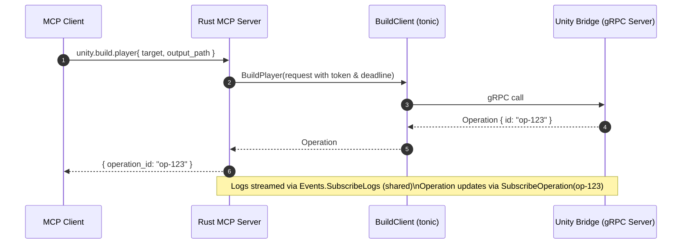

# gRPC Protocol (L0) — Design & Compilation Guide

> **Scope**: Define the Unity Bridge gRPC protocol for the MCP Server at **L0** (no googleapis dependencies). Use `proto3`, keep messages additive, and compile client stubs for Rust (tonic/prost) and server stubs for C# (Unity Editor). This document aligns with the previously agreed service surface (EditorControl, Assets, Build, Operations, Events).

---

## 1) Policy & Versioning

- **L0**: No `googleapis` imports (e.g., no `google/rpc/*`, `google/api/*`, `google/longrunning/*`).
- Use `` with **additive evolution** (add fields/services; avoid breaking changes).
- **Package**: `mcp.unity.v1`. For breaking changes, introduce `mcp.unity.v2` side‑by‑side.
- **Namespaces (optional)**:
  ```proto
  option csharp_namespace = "UnityMcp.Grpc.V1";
  ```

---

## 2) File Layout

```
proto/
  mcp/unity/v1/
    common.proto
    editor_control.proto
    assets.proto
    build.proto
    operations.proto
    events.proto
```

---

## 3) Common Types (L0)

- **Timestamps**: Prefer `uint64` for epoch millis at L0 to avoid extra well‑known dependencies. (You may switch to `google.protobuf.Timestamp` later if desired.)
- **Results**: Keep results **opaque** initially via `bytes result` + `string content_type` (e.g., `application/json`).
- **Errors**: Human‑readable `string error` in `OperationStatus` for domain failures. Transport failures use gRPC status codes.

```proto
// common.proto
syntax = "proto3";
package mcp.unity.v1;

message Operation {
  string id = 1;         // e.g., "op-123"
  string kind = 2;       // "build", "asset/import", ...
  uint64 started_at = 3; // epoch millis
}

message OperationStatus {
  string id = 1;
  enum State { PENDING = 0; RUNNING = 1; SUCCEEDED = 2; FAILED = 3; CANCELED = 4; }
  State state = 2;
  float progress = 3;        // 0..1
  string message = 4;        // user-friendly status text
  bytes  result = 5;         // opaque payload (e.g., JSON bytes)
  string content_type = 6;   // e.g., "application/json"
  string error = 7;          // error summary on FAILED
  uint64 updated_at = 8;     // epoch millis (optional but helpful)
}

message LogEvent {
  enum Level { VERBOSE = 0; INFO = 1; WARN = 2; ERROR = 3; }
  Level level = 1;
  string message = 2;
  string source = 3;  // "Unity", "Editor", "BuildPipeline", ...
  uint64 ts = 4;      // epoch millis
}
```

**Compatibility rules**

- Never reuse field numbers; when removing, `` the numbers and/or names.
- Avoid renaming fields; add new fields instead and deprecate old ones.

---

## 4) Services & Messages

### 4.1 Editor Control

```proto
// editor_control.proto
syntax = "proto3";
package mcp.unity.v1;

message HealthRequest {}
message HealthResponse { string version = 1; bool ready = 2; }

message GetPlayModeRequest {}
message GetPlayModeResponse { bool is_playing = 1; }

message SetPlayModeRequest { bool is_playing = 1; }

service EditorControl {
  rpc Health(HealthRequest) returns (HealthResponse);
  rpc GetPlayMode(GetPlayModeRequest) returns (GetPlayModeResponse);
  rpc SetPlayMode(SetPlayModeRequest) returns (Operation);
}
```

### 4.2 Assets

```proto
// assets.proto
syntax = "proto3";
package mcp.unity.v1;

message ImportRequest { string path = 1; bool recursive = 2; }
message RefreshRequest { string scope = 1; }
message MoveRequest { string from = 1; string to = 2; }
message DeleteRequest { string path_or_guid = 1; }
message PathToGuidRequest { string path = 1; }
message PathToGuidResponse { string guid = 1; }
message GuidToPathRequest { string guid = 1; }
message GuidToPathResponse { string path = 1; }

service Assets {
  rpc Import(ImportRequest) returns (Operation);
  rpc Refresh(RefreshRequest) returns (Operation);
  rpc Move(MoveRequest) returns (Operation);
  rpc Delete(DeleteRequest) returns (Operation);
  rpc PathToGuid(PathToGuidRequest) returns (PathToGuidResponse);
  rpc GuidToPath(GuidToPathRequest) returns (GuidToPathResponse);
}
```

### 4.3 Build

```proto
// build.proto
syntax = "proto3";
package mcp.unity.v1;

message BuildPlayerRequest {
  string target = 1;                // e.g., "Android", "iOS", "Windows"
  string output_path = 2;           // absolute or project-relative
  map<string, string> options = 3;  // extensible toggle bag
}

service Build {
  rpc BuildPlayer(BuildPlayerRequest) returns (Operation);
}
```

### 4.4 Operations

```proto
// operations.proto
syntax = "proto3";
package mcp.unity.v1;

message GetOperationRequest { string id = 1; }
message CancelOperationRequest { string id = 1; }
message CancelOperationResponse { bool accepted = 1; }

service Operations {
  rpc GetOperation(GetOperationRequest) returns (OperationStatus);
  rpc CancelOperation(CancelOperationRequest) returns (CancelOperationResponse);
}
```

### 4.5 Events (server streaming)

```proto
// events.proto
syntax = "proto3";
package mcp.unity.v1;

message SubscribeLogsRequest { repeated LogEvent.Level levels = 1; }
message SubscribeOperationRequest { string id = 1; }

service Events {
  rpc SubscribeLogs(SubscribeLogsRequest) returns (stream LogEvent);
  rpc SubscribeOperation(SubscribeOperationRequest) returns (stream OperationStatus);
}
```

---

## 5) Error, Cancellation & Streaming Semantics (L0)

- **Transport errors**: return proper gRPC status codes (e.g., `INVALID_ARGUMENT`, `NOT_FOUND`, `DEADLINE_EXCEEDED`, `UNAVAILABLE`, `INTERNAL`).
- **Domain failures**: surface as `OperationStatus{ state=FAILED, error=... }` on operation streams or `GetOperation`.
- **Cancellation**: support both gRPC call cancellation (client abort / deadline) and explicit `CancelOperation`.
- **Streaming**: `SubscribeLogs` is a single shared subscription on the server side, fanned out to multiple clients; `SubscribeOperation` is per‑operation on demand.

---

## 6) Rust Codegen (client stubs)

``

```toml
[build-dependencies]
tonic-build = "0.11"

[dependencies]
tonic = { version = "0.11", features = ["transport", "tls"] }
prost = "0.12"
prost-types = "0.12" # if you later switch to well-known types
```

``

```rust
fn main() -> Result<(), Box<dyn std::error::Error>> {
    let protos = &[
        "proto/mcp/unity/v1/common.proto",
        "proto/mcp/unity/v1/editor_control.proto",
        "proto/mcp/unity/v1/assets.proto",
        "proto/mcp/unity/v1/build.proto",
        "proto/mcp/unity/v1/operations.proto",
        "proto/mcp/unity/v1/events.proto",
    ];

    tonic_build::configure()
        .build_server(false)      // Rust side is a gRPC client only
        .out_dir("src/generated")
        .compile(protos, &["proto"]) ?;

    println!("cargo:rerun-if-changed=proto");
    Ok(())
}
```

**Notes**

- Keep generated files out of the VCS or commit them consistently; choose one approach and enforce via CI.
- If you later adopt `google.protobuf.Timestamp`, add `prost-types` (already listed) and import it in protos.

---

## 7) C# Codegen (Unity Editor server stubs)

Use `protoc` + `grpc_csharp_plugin` (via `Grpc.Tools` NuGet) to generate **messages + service bases** into Unity `Assets/Editor/Generated/Proto`.

`` (example)

```bash
#!/usr/bin/env bash
set -euo pipefail

PROTO_ROOT=proto
OUT=bridge/Assets/Editor/Generated/Proto
mkdir -p "$OUT"

# Resolve protoc and plugin (install Grpc.Tools and export paths, or set absolute paths here)
PROTOC=protoc
PLUGIN=$(which grpc_csharp_plugin)

$PROTOC -I"$PROTO_ROOT" \
  "$PROTO_ROOT/mcp/unity/v1/common.proto" \
  "$PROTO_ROOT/mcp/unity/v1/editor_control.proto" \
  "$PROTO_ROOT/mcp/unity/v1/assets.proto" \
  "$PROTO_ROOT/mcp/unity/v1/build.proto" \
  "$PROTO_ROOT/mcp/unity/v1/operations.proto" \
  "$PROTO_ROOT/mcp/unity/v1/events.proto" \
  --csharp_out="$OUT" \
  --grpc_out="$OUT" \
  --plugin=protoc-gen-grpc="$PLUGIN"
```

**Unity specifics**

- Add `Google.Protobuf` and `Grpc.Core` runtime assemblies to the Unity project.
- Place generated `.cs` under `Assets/Editor/Generated/Proto`. Consider an `.asmdef` to scope Editor‑only code.
- On Editor exit, ensure `Grpc.Core.Server.ShutdownAsync()` is awaited to free ports cleanly.

---

## 8) CI & Parity Checks

- **Codegen parity**: in CI, rerun Rust and C# codegen and **fail** if committed outputs drift (if you commit generated code).
- **No‑commit flow**: alternatively, always generate at build time in CI and never commit generated files.
- Consider adding `buf lint` later; at L0 it’s optional.

---

## 9) Evolution Playbook (staying L0‑friendly)

- Add fields with new numbers; keep old fields for a deprecation period; never reuse numbers.
- If result types stabilize, replace `bytes result + content_type` with typed messages (via new fields) while keeping the old field for compatibility.
- If you later need richer errors, you can introduce `mcp.unity.v2` that uses `google.rpc.Status` without breaking v1.

---

## 10) Minimal End‑to‑End Diagram



---

## 11) Common Pitfalls & Fixes

- **Field number reuse** → never; use `reserved` for removed fields.
- **Large **``** payloads** → consider compressing JSON before placing into `bytes result`.
- **Clock skew** → when using millis, prefer server‑side timestamps for `started_at/updated_at`.
- **Backpressure** → cap broadcast buffers, drop/coalesce INFO, never drop WARN/ERROR.

---

## 12) Ready‑to‑Copy Stubs

**Append these six files under **``** and run the codegen scripts.**

- `common.proto` (above)
- `editor_control.proto` (above)
- `assets.proto` (above)
- `build.proto` (above)
- `operations.proto` (above)
- `events.proto` (above)

That’s it — you can compile stubs today, keep L0 simple, and still leave room to scale up later.

