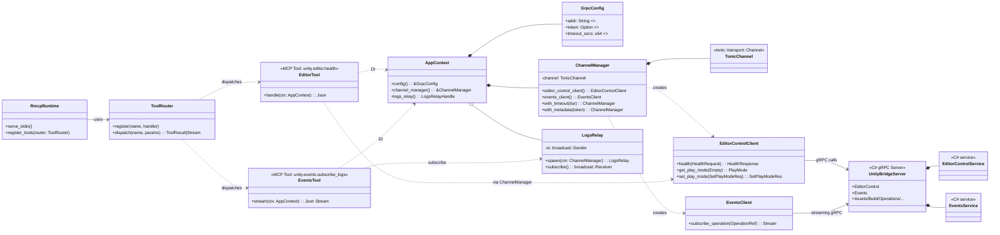
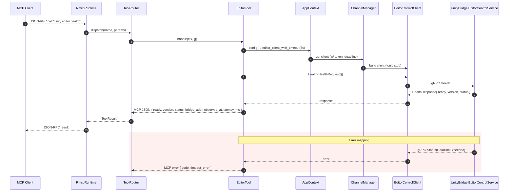
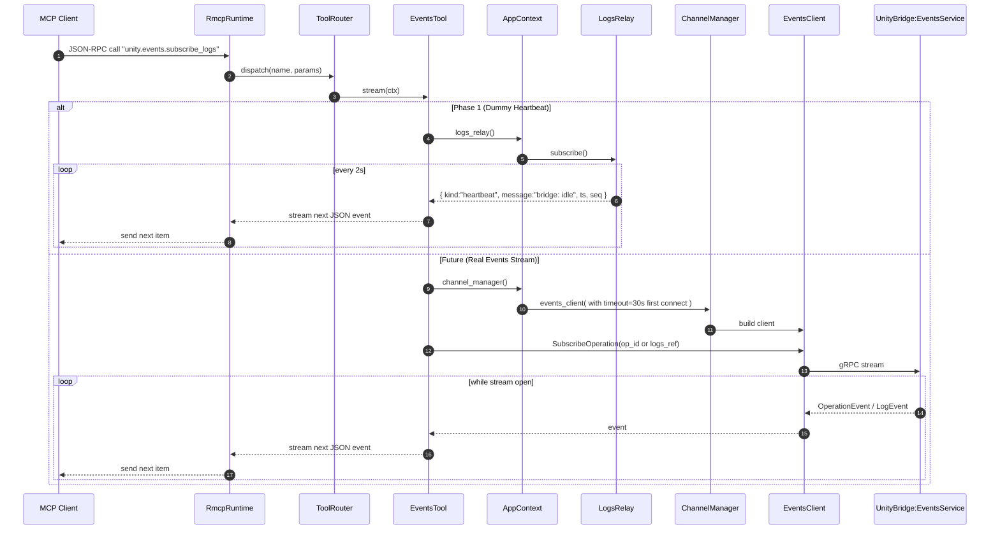

# MCP–gRPC Architecture: Class & Sequence Diagrams

This document visualizes how the rmcp runtime, ToolRouter, Rust-side gRPC clients, and the shared `AppContext` fit together, and how requests traverse the stack for Health and Logs in Phase 1 (dummy relay) and later (real Events stream).

---

## Class Diagram

**Key Responsibilities**

- **rmcp / ToolRouter**: transport + dispatch; normalize errors to MCP codes.
- **AppContext**: shared dependency container (config, client factory, relay handle).
- **ChannelManager**: builds typed clients; injects auth (`Authorization: Bearer …`) and per-call deadlines.
- **LogsRelay (Phase 1)**: dummy heartbeat broadcaster; later swapped for real Events stream.

---

## Sequence Diagram — Health (unity.editor.health)

**Notes**

- Per-call timeout is enforced (5s) via `ChannelManager`.
- Error mapping (gRPC → MCP): `Unavailable→service_unavailable`, `DeadlineExceeded→timeout_error`, others → `internal_error`.

---

## Sequence Diagram — Logs (unity.events.subscribe\_logs)

**Notes**

- Phase 1 uses a server-internal broadcast relay; later we switch to the Unity `Events` gRPC stream without changing the MCP tool’s external shape.
- The relay should be bounded (`broadcast`) and drop-oldest under pressure.

---

## Error Mapping & Config Keys (for reference)

- **gRPC → MCP**: `Unavailable→service_unavailable`, `DeadlineExceeded→timeout_error`, else `internal_error`.
- **Env keys**: `MCP_BRIDGE_ADDR`, `MCP_BRIDGE_TOKEN`, `MCP_BRIDGE_TIMEOUT` (seconds).

