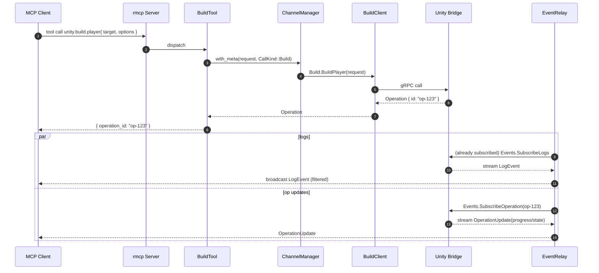

# Rust MCP Server Design (rmcp + gRPC Bridge)

> **Scope**: Rust-based MCP Server implemented with `rmcp` (optionally `rmcp-macros`), communicating with a Unity Editor Bridge over **gRPC**. The server exposes MCP tools, delegates execution to Unity, returns an **Operation ID** for long jobs, and streams **logs/progress**.

---

## 1) Goals & Principles

- **Single orchestration point** for MCP tools; Unity Bridge is the sole executor of Unity APIs.
- **Consistency**: Every actionable tool returns an `Operation{id}`. Progress & logs are streamed.
- **Separation of concerns**: transport (rmcp) ≠ business adapters (ToolHandlers) ≠ infra (ChannelManager, EventRelay).
- **Centralized cross‑cutting policies**: authentication, deadlines, retries, concurrency limits, tracing.

---

## 2) Architecture Overview

```mermaid
flowchart LR
  subgraph Client[IDE / Agent]
    MC[MCP Client]
  end

  subgraph Server[Rust MCP Server]
    RT[rmcp runtime]
    TR[ToolRouter]
    TH[ToolHandlers\n(Assets/Build/Editor/Ops/Events)]
    CM[ChannelManager\n(tonic + tower)]
    ER[EventRelay\n(logs/op updates multiplexer)]
    OC[OperationCache]
  end

  subgraph Bridge[Unity Editor Bridge]
    GRPC[gRPC Server]
    UA[Unity APIs]
  end

  MC --> RT --> TR --> TH --> CM --> GRPC
  GRPC --> ER --> RT
  ER --> MC
  TH --> OC
```

**Notes**

- `rmcp-macros` may be used to publish tools (reduces boilerplate), but the core design is independent of macros.
- Logs are subscribed **once** (single stream) and fanned out; operation updates are **on-demand** per `op_id`.

---

## 3) Key Components (Responsibilities & Relations)

### ToolRouter

- Dispatches **MCP tool name → ToolHandler**.
- Normalizes errors to MCP error codes.
- Macro path: `#[tool(name = ...)]` functions bundled with a `tools![...]` registrar.

### ToolHandlers (Assets / Build / Editor / Ops / Events)

- **Thin adapters**: validate inputs → call gRPC → shape MCP response.
- Always return `Operation{id}` for actionable commands; leverage **EventRelay** or `ops.get` for progress/results.
- Obtain service clients via **ChannelManager** (enforces auth/deadlines/retry/limits).

### ChannelManager

- Single **HTTP/2** gRPC channel (multiplexed) and tower layers (retry/backoff/concurrency limit).
- Injects **auth token** & **deadline** per call (`with_meta(req, CallKind)`).
- Provides typed clients: `AssetsClient`, `BuildClient`, `EditorControlClient`, `OperationsClient`, `EventsClient`.

### EventRelay

- **Logs**: subscribe once to `Events.SubscribeLogs`, broadcast via `tokio::sync::broadcast` to multiple MCP sessions.
- **Operation updates**: on-demand `SubscribeOperation(op_id)`, multiplexed to all interested sessions.
- Backpressure: drop/aggregate **INFO**, never drop **WARN/ERROR**; keep latest when receivers lag.

### OperationCache

- Short-lived **shadow state** for `op_id → latest status` (fast `ops.get`, reconnect resilience).

### ErrorMapper & Observability

- Map `tonic::Status`/domain errors → MCP codes; always attach a human-readable message.
- `tracing` spans with `op_id/req_id`; optional OpenTelemetry export.

---

## 4) gRPC Service Surface (Unity Bridge)

- **EditorControl**: `Health`, `SetPlayMode`, configuration updates, graceful quit.
- **Assets**: `Import`, `Move`, `Delete`, `Refresh`, `PathToGuid`, `GuidToPath`.
- **Build**: `BuildPlayer` → `Operation`.
- **Operations**: `GetOperation` / `CancelOperation` / `List`.
- **Events**: server-stream `LogEvent` and `OperationUpdate`.

---

## 5) Control Flow (Typical: `unity.build.player`)



Non-stream clients poll `ops.get(op_id)`; cache serves fast, falls back to Bridge.

---

## 6) Cross‑Cutting Policies

- **Auth & Deadlines**: enforced centrally by ChannelManager (`with_meta`).
- **Retry & Limits**: `tower` layers for backoff (Unavailable/DeadlineExceeded/etc.) and concurrency caps.
- **Backpressure**: broadcast with bounded buffers; coalesce INFO; prioritize WARN/ERROR.
- **Security**: default `127.0.0.1` with shared token; TLS + allowlist for remote.
- **Observability**: structured logs; metrics for op latency/failure, build success rate, stream lag/drop.

---

## 7) Lifecycle & Recovery

- **Startup**: load Config → init tracing → build ChannelManager → start EventRelay (logs) → register tools → run rmcp.
- **Disconnects**: exponential backoff reconnect; resync operation states via `GetOperation`.
- **Shutdown**: stop rmcp, complete streams, close channel gracefully.

---

## 8) Testing & CI

- **Unit**: input validation, error mapping, `with_meta` application.
- **Component**: tonic mock servers for each service; Tool→gRPC roundtrip.
- **E2E**: against a dummy Bridge (health/logs/op update).
- **CI**: protobuf codegen parity (Rust/C#), `clippy`, analyzers, minimal Unity Editor tests.

---

## 9) Directory Layout (example)

```
server/
  src/
    config.rs
    grpc/{ channel.rs, clients.rs, types.rs }
    tools/{ assets.rs, build.rs, editor.rs, ops.rs, events.rs }
    relay/{ logs.rs, operations.rs }
    error.rs
    observability.rs
    main.rs
proto/
  unity_mcp/*.proto
bridge/
  Assets/Editor/{ Services/*, Operations/*, Generated/Proto/* }
```

---

## 10) Minimal Code Snippets (illustrative)

**ChannelManager** (auth + deadline injection)

```rust
pub fn with_meta<T>(&self, mut req: tonic::Request<T>, kind: CallKind) -> tonic::Request<T> {
  if let Some(t) = &self.token { req.metadata_mut().insert("x-bridge-token", t.clone()); }
  req.set_timeout(self.timeouts.for_kind(kind));
  req
}
```

**Build tool** (macro style; signature illustrative)

```rust
#[tool(name = "unity.build.player")]
pub async fn build_player(cm: ChannelManager, input: BuildInput) -> Result<OperationOut, McpError> {
  let mut cli = cm.client_build();
  let req = cm.with_meta(tonic::Request::new(input.into_proto()), CallKind::Build);
  let op = cli.build_player(req).await?.into_inner();
  Ok(OperationOut::from_proto(op))
}
```

---

## 11) MVP Implementation Order

1. **Config + ChannelManager + Health**
2. **EventRelay (Logs)**
3. **Path⇄GUID / Import / Refresh**
4. **BuildPlayer + Operation updates**
5. **Cancel/Timeout/Retry hardening**

---

### Appendix — Design Rationale

- Centralizing gRPC policy in **ChannelManager** prevents configuration drift and simplifies token rotation & reconnect.
- **EventRelay** decouples streaming fan‑out from tool logic and enables backpressure/aggregation.
- Returning `Operation` uniformly simplifies UX, telemetry, and retry semantics across tools.

