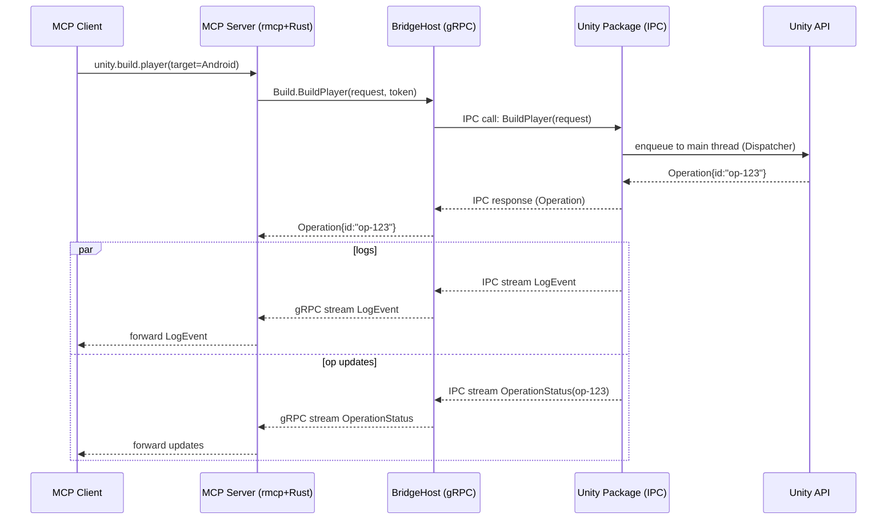

# Unity MCP Server — Architecture (External BridgeHost Variant)

> **Goal**: Run the Unity-side gRPC **server** out-of-process as a standalone .NET app (**BridgeHost**), while the Unity Editor package remains a lightweight **launcher/proxy** that executes Unity API calls on the main thread. The Rust MCP Server keeps acting as a gRPC **client**.

---

## 1) High‑Level Architecture

```mermaid
flowchart LR
    subgraph Client[LLM Client / IDE / Agent]
      M[MCP Client]
    end

    subgraph Server[MCP Server (Rust)]
      R[rmcp runtime\n(JSON-RPC over stdio/SSE)]
      G[gRPC Client (tonic)]
    end

    subgraph Host[BridgeHost (external process, .NET 8)]
      BH[gRPC Server\n(Grpc.AspNetCore)]
      AD[IPC Adapter]
    end

    subgraph Unity[Unity Editor Package (UPM)]
      L[BridgeController (launcher)]
      IPC[IPC Server\n(Named Pipe / UDS / Local HTTP)]
      D[Dispatcher\n(Main Thread)]
      UA[Unity API (AssetDatabase, BuildPipeline, ...)]
    end

    M -- MCP (stdio/SSE) --> R
    R --> G
    G -- gRPC --> BH
    BH --> AD --> IPC --> D --> UA
    UA --> IPC
    BH -- server-stream --> G
    R -- stream logs/progress --> M
```

**Roles**
- **Rust MCP Server**: presents MCP tools, validates inputs, calls BridgeHost via gRPC, aggregates results/streams, maps errors.
- **BridgeHost (external)**: stable gRPC server (ASP.NET Core) that forwards requests to Unity over local IPC; re-exposes logs and operation updates as gRPC streams.
- **Unity Package**: launches/stops BridgeHost, provides IPC endpoint, executes Unity API calls on the main thread, pushes logs/events.

---

## 2) Process & Startup Model

- **Normal mode**: Unity Editor opens → Package auto-starts **BridgeHost** if not running → health poll until ready → Rust MCP Server connects (shared token + port).
- **Optional auto-launch from Rust**: MCP Server can start Unity with `-projectPath` and bootstrap args; then wait for BridgeHost readiness.



---

## 3) gRPC API Surface (unchanged)

- **EditorControl**: `Health`, `GetPlayMode`, `SetPlayMode` (returns `Operation`).
- **Assets**: `Import`, `Move`, `Delete`, `Refresh`, `PathToGuid`, `GuidToPath`.
- **Build**: `BuildPlayer` → returns `Operation`.
- **Operations**: `GetOperation`, `CancelOperation`.
- **Events**: `SubscribeLogs` (server-stream), `SubscribeOperation` (server-stream).

> BridgeHost implements these services and **forwards** to Unity via IPC. Domain results & errors are surfaced as before.

---

## 4) Unity IPC Design (Package ↔ BridgeHost)

- **Transport**: Named Pipe (Windows) / Unix Domain Socket (macOS/Linux) are preferred; fallback: local HTTP (loopback).
- **Patterns**:
  - Request/Response for actionable RPCs (returns `Operation`).
  - Push streams for **logs** and **operation updates**.
- **Main‑thread safety**: all Unity API calls are queued to a `Dispatcher` (runs via `EditorApplication.delayCall`).
- **Backpressure**: coalesce INFO, never drop WARN/ERROR; keep latest `OperationStatus` per `op_id`.

---

## 5) Security

- **gRPC**: loopback `127.0.0.1:<port>` + shared **token** (`x-bridge-token`) in gRPC metadata.
- **IPC**: local OS primitives (pipes/UDS) scoped to the current user. Consider extra token in IPC handshake.
- **Modes**: read-only (events only), allow-list of callers, and optional TLS (if exposing beyond localhost).

---

## 6) Deployment & Distribution

**BridgeHost (.NET 8 self-contained) delivery options:**
- **Bootstrap download (recommended)**: Unity package ships a small launcher. On first run it downloads the correct OS/arch binary from a manifest (URL + SHA256), caches under `Library/BridgeHost/<ver>/`.
- **Bundled in package**: include per-OS binaries under `Editor/Tools/BridgeHost/<rid>/`. Simple, but increases package size and complicates updates.
- **User-specified path**: enterprise-friendly; admins manage installation via internal artifact store.

**Unity Package (UPM)**
- Remains `.NET Standard 2.1` (Editor-only asmdef). No server runtime inside Unity.

---

## 7) Configuration

- **Port**: default `50061` (configurable via Unity settings and CLI args to BridgeHost).
- **Token**: generated/stored by package (EditorPrefs or file). Injected into gRPC metadata and IPC handshake.
- **Auto-start**: toggle in Unity menu/settings; start on Editor load; stop on quitting.

---

## 8) Directory Layout (proposed)

```
repo-root/
├─ server/                       # Rust MCP Server (rmcp + tonic)
│  └─ ...
├─ bridge/                       # Unity project
│  ├─ Packages/
│  │   └─ com.example.mcp-bridge/
│  │       ├─ Editor/
│  │       │   ├─ BridgeController.cs        # start/stop, health, settings UI
│  │       │   ├─ Ipc/ { IpcServer.cs, Dispatcher.cs }
│  │       │   ├─ Services/                   # thin Unity wrappers
│  │       │   └─ Generated/Proto/            # (optional) shared message types
│  │       └─ package.json
│  └─ ProjectSettings/
├─ bridge-host/                  # External gRPC server (.NET 8)
│  ├─ BridgeHost.csproj          # <TargetFramework>net8.0</TargetFramework>
│  ├─ Program.cs                 # Kestrel + Grpc.AspNetCore
│  ├─ Grpc/Services/             # EditorControl/Assets/Build/Ops/Events
│  ├─ Grpc/Adapters/             # IPC adapters toward Unity package
│  └─ app.manifest.json          # URLs, RIDs, SHA256
├─ proto/
│  └─ mcp/unity/v1/*.proto
└─ .github/workflows/
   ├─ rust-ci.yml
   ├─ unity-ci.yml
   └─ bridge-host-ci.yml         # self-contained publish per OS/arch
```

---

## 9) Observability & Reliability

- **Structured logs** at BridgeHost and Rust MCP Server; correlate by `operation_id`.
- **Health** RPC exposed by BridgeHost; Unity package polls during bootstrap.
- **Reconnect**: BridgeHost retries IPC to Unity; Rust client backs off on gRPC channel errors.
- **Operation cache** at BridgeHost (latest `OperationStatus`), improves `ops.get` latency.

---

## 10) Failure Modes & Mitigations

- **Port in use**: probe and pick next port (or prompt). Surface in Unity settings.
- **BridgeHost down**: Unity shows status and offers restart; Rust side returns `UNAVAILABLE` until recovery.
- **Unity editor not responding**: IPC timeout → set `FAILED` with diagnostic; keep BridgeHost up.
- **Excess logs**: rate-limit INFO, never drop WARN/ERROR; bounded buffers with drop-oldest policy for verbose streams.

---

## 11) MVP — Safe First Steps

1. BridgeHost: `EditorControl.Health` + Kestrel h2c on `127.0.0.1:50061`.
2. Unity package: launcher + IPC echo server; push Console logs as stream.
3. Path⇄GUID (no side effects) via IPC.
4. Import/Refresh (basic asset ops) + operation updates.
5. BuildPlayer end-to-end + cancel semantics.

---

## 12) Technology Choices

- **Rust**: `rmcp`, `tonic`, `prost`, `tracing`.
- **BridgeHost**: .NET 8, `Grpc.AspNetCore`, `Google.Protobuf`, interceptors.
- **Unity Package**: .NET Standard 2.1 (Editor-only asmdef), IPC server, main-thread dispatcher.
- **Transports**: MCP stdio/SSE (server) ↔ gRPC (BridgeHost) ↔ IPC (Unity main thread execution).

---

## 13) Appendix — Minimal BridgeHost Bootstrap (sketch)

```csharp
// Program.cs (.NET 8)
using Microsoft.AspNetCore.Server.Kestrel.Core;
var builder = WebApplication.CreateBuilder(args);
builder.Services.AddGrpc(o => {
    // o.Interceptors.Add<AuthInterceptor>();
    // o.Interceptors.Add<LoggingInterceptor>();
});

builder.WebHost.ConfigureKestrel(o =>
    o.ListenLocalhost(50061, lo => lo.Protocols = HttpProtocols.Http2)); // h2c

var app = builder.Build();
app.MapGrpcService<EditorControlService>();
app.Lifetime.ApplicationStarted.Register(() => Console.WriteLine("[Bridge] Started on 127.0.0.1:50061"));
app.Lifetime.ApplicationStopping.Register(() => Console.WriteLine("[Bridge] Stopped"));
app.Run();
```

This variant preserves the original protocol and division of responsibilities, while removing the .NET Standard constraint from server hosting and keeping Unity safe on the main thread.

