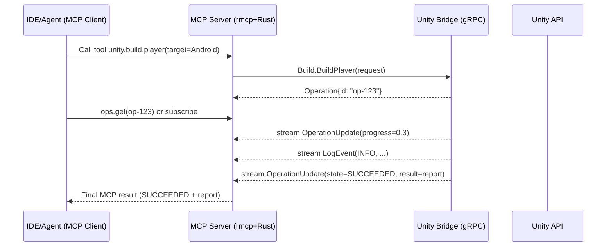
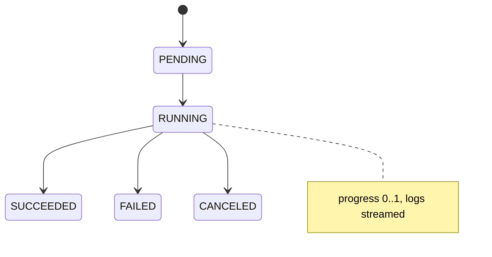

# Unity MCP Server — End‑to‑End Architecture (rmcp + gRPC Bridge)

> **Goal**: Implement an MCP Server in Rust (using `rmcp`) that exposes tools to IDEs/agents, and a Unity Editor Bridge (C#) that executes Unity API operations over **gRPC**. The server orchestrates; the bridge performs. All long‑running work returns an **Operation ID** with live **streamed logs & progress**.

---

## 1) High‑Level Architecture

```mermaid
flowchart LR
    subgraph Client[LLM Client / IDE / Agent]
      M[MCP Client]
    end

    subgraph Server[MCP Server (Rust)]
      R[rmcp runtime\n(JSON-RPC over stdio/SSE)]
      G[gRPC Client\n(tonic)]
    end

    subgraph Bridge[Unity Editor Bridge (C#)]
      UGRPC[gRPC Server]
      D[Dispatcher\n(Main Thread)]
      JM[Job Manager\n(Operations)]
      UA[Unity API\n(AssetDatabase, BuildPipeline, ...)]
    end

    M -- MCP (stdio/SSE) --> R
    R --> G
    G -- RPC --> UGRPC
    UGRPC --> D --> UA
    UA --> JM
    UGRPC -- server-stream --> R
    R -- stream logs/progress --> M
```

**Roles**

- **Rust MCP Server**: presents MCP tools, validates inputs, calls Unity via gRPC, aggregates results/streams, maps errors.
- **Unity Bridge**: authoritative executor of Unity APIs; serializes to main thread; manages long tasks as **Operations**.

---

## 2) Process & Startup Model

- **Normal mode**: Unity Editor starts → Bridge hosts gRPC on `localhost:<port>` → MCP Server connects (health check + token).
- **Optional auto‑launch**: MCP Server can start Unity with `-projectPath` and bridge bootstrap args, then wait for readiness.



---

## 3) gRPC API Surface (proposed)

**Service split**

- `EditorControl`: health, play mode, apply settings, graceful shutdown.
- `Assets`: import/move/delete/refresh, path⇄GUID.
- `Build`: build player, return Operation.
- `Operations`: get/cancel/list operations.
- `Events`: **server‑streaming** logs and per‑operation updates.

**Proto sketch**

```proto
syntax = "proto3";
package mcp.unity.v1;

service EditorControl { rpc Health(HealthRequest) returns (HealthResponse); }
service Assets {
  rpc Import(ImportRequest) returns (Operation);
  rpc Move(MoveRequest) returns (Operation);
  rpc Delete(DeleteRequest) returns (Operation);
  rpc Refresh(RefreshRequest) returns (Operation);
  rpc PathToGuid(PathToGuidRequest) returns (PathToGuidResponse);
  rpc GuidToPath(GuidToPathRequest) returns (GuidToPathResponse);
}
service Build { rpc BuildPlayer(BuildPlayerRequest) returns (Operation); }
service Operations {
  rpc GetOperation(GetOperationRequest) returns (OperationStatus);
  rpc CancelOperation(CancelOperationRequest) returns (CancelOperationResponse);
}
service Events {
  rpc SubscribeLogs(SubscribeLogsRequest) returns (stream LogEvent);
  rpc SubscribeOperation(SubscribeOperationRequest) returns (stream OperationUpdate);
}

message Operation { string id=1; string kind=2; int64 started_at=3; }
message OperationStatus {
  string id=1;
  enum State { PENDING=0; RUNNING=1; SUCCEEDED=2; FAILED=3; CANCELED=4; }
  State state=2; float progress=3; string message=4; bytes result=5; string error=6;
}
```

**Design notes**

- Always return an `Operation` (even for short tasks) for UI consistency & telemetry.
- Stream **logs** + **OperationUpdate** for real‑time UX.
- Use `bytes`/`Any` (JSON payload allowed) for schema‑evolvable results.
- Support both gRPC cancel (client‑side) and explicit `CancelOperation`.

---

## 4) MCP Tools ↔ gRPC Mapping

| MCP Tool                      | Parameters (examples)             | gRPC call                   | Returns           |
| ----------------------------- | --------------------------------- | --------------------------- | ----------------- |
| `unity.asset.import`          | `path`, `options`                 | `Assets.Import`             | `operation_id`    |
| `unity.asset.move`            | `from`, `to`                      | `Assets.Move`               | `operation_id`    |
| `unity.asset.delete`          | `pathOrGuid`                      | `Assets.Delete`             | `operation_id`    |
| `unity.asset.refresh`         | `scope`                           | `Assets.Refresh`            | `operation_id`    |
| `unity.asset.path_to_guid`    | `path`                            | `Assets.PathToGuid`         | `guid`            |
| `unity.asset.guid_to_path`    | `guid`                            | `Assets.GuidToPath`         | `path`            |
| `unity.build.player`          | `target`, `options`, `outputPath` | `Build.BuildPlayer`         | `operation_id`    |
| `unity.playmode.set`          | `isPlaying`                       | `EditorControl.SetPlayMode` | `operation_id`    |
| `unity.ops.get`               | `operation_id`                    | `Operations.GetOperation`   | `status`          |
| `unity.events.subscribe_logs` | `levels`                          | `Events.SubscribeLogs`      | stream `LogEvent` |

---

## 5) Unity Bridge (C#) — Implementation Notes

- **Main‑thread safety**: dispatch all Unity API calls via a dedicated Dispatcher (`EditorApplication.delayCall`, custom queue).
- **Job Manager**: long tasks → track `Operation{ id, kind }` + `OperationStatus{ state, progress }`; persist last results.
- **Logging**: hook `Application.logMessageReceivedThreaded` → map to `LogEvent` levels → push to `Events` streams.
- **Robustness**: catch all exceptions → set `FAILED` with compact stack; complete streams on Editor quit.

---

## 6) MCP Server (Rust) — Implementation Notes

- **rmcp**: define tools, validate inputs, stream responses; map gRPC errors → MCP errors.
- **gRPC client**: `tonic` + `prost`; connection backoff; per‑call deadline; metadata token.
- **Operation model**: unify poll (`ops.get`) and subscribe (events) so clients without streaming still work.

---

## 7) Directory Layout (proposed)

```
repo-root/
├─ server/                 # Rust MCP Server (rmcp + tonic)
│  ├─ src/
│  ├─ Cargo.toml
│  └─ build.rs             # optional: proto codegen trigger
├─ bridge/                 # Unity project (Editor extension)
│  ├─ Assets/
│  │   └─ Editor/
│  │       ├─ BridgeServer.cs
│  │       ├─ Operations/*.cs
│  │       ├─ Services/*.cs
│  │       └─ Generated/Proto/*.cs
│  └─ ProjectSettings/
├─ proto/                  # shared .proto + generators
│  ├─ unity_mcp/*.proto
│  ├─ Cargo.toml           # prost-build for Rust
│  └─ generate_csharp.sh   # csharp_out to Unity
└─ .github/workflows/
   ├─ rust-ci.yml
   ├─ unity-ci.yml
   └─ lint.yml
```

---

## 8) Operation State Model



---

## 9) Concurrency & Backpressure

- **Bridge**: Unity API on main thread; queue or serialize; use workers for I/O/serialization.
- **Server**: async (Tokio); rate‑limit parallel tool invocations; configurable.
- **Backpressure**: buffer log/events; drop/aggregate verbose INFO; prioritize WARN/ERROR.

---

## 10) Error Handling & Timeouts

- Map gRPC `Status` → MCP errors (`InvalidArgument`, `NotFound`, `DeadlineExceeded`, ...).
- Idempotency guards for path‑based ops (e.g., pre‑check before `Move`).
- Sensible defaults: build ≤ 30 min, asset ops ≤ 5 min (override via tool params).

---

## 11) Security

- Local default: `127.0.0.1:<port>` + shared token (env or `.bridge-token`).
- Remote: TLS required, IP allow‑list, optional read‑only mode (events only).

---

## 12) Observability

- **Server**: `tracing` structured logs; optional OpenTelemetry export.
- **Bridge**: correlate logs with `OperationId`.
- **Metrics**: op count/fail rate/latency, build success rate, stream lag.

---

## 13) CI/CD Essentials

- Proto codegen parity checks (Rust/C#) — fail CI on drift.
- Unity EditorMode/PlayMode tests for key services.
- Static analysis: Rust `clippy`, C# analyzers.
- Releases: server binaries (per‑OS); bridge as UPM package or `Assets/Editor` drop‑in.

---

## 14) MVP — Safe First Steps

1. **Health + Logs** (connectivity & observability)
2. **Path⇄GUID** (no side effects)
3. **Import/Refresh** (basic asset operations)
4. **BuildPlayer** (end‑to‑end Operation + streams)
5. **PlayMode** (state transition, cancel semantics)

---

### Appendix — Technology Choices

- Rust: `rmcp`, `tokio`, `tonic`, `prost`, `tracing`.
- C#: `Grpc.AspNetCore`, `Google.Protobuf`, Unity Editor API.
- Transport: MCP stdio/SSE on server side; gRPC over localhost for Editor bridge.

