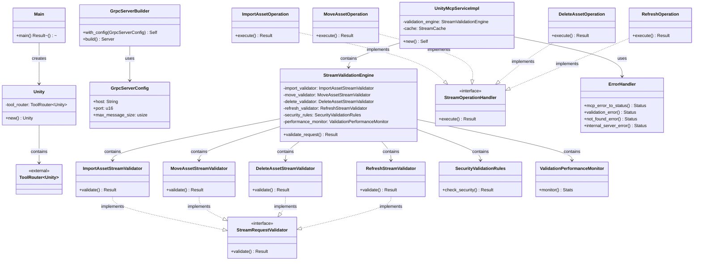
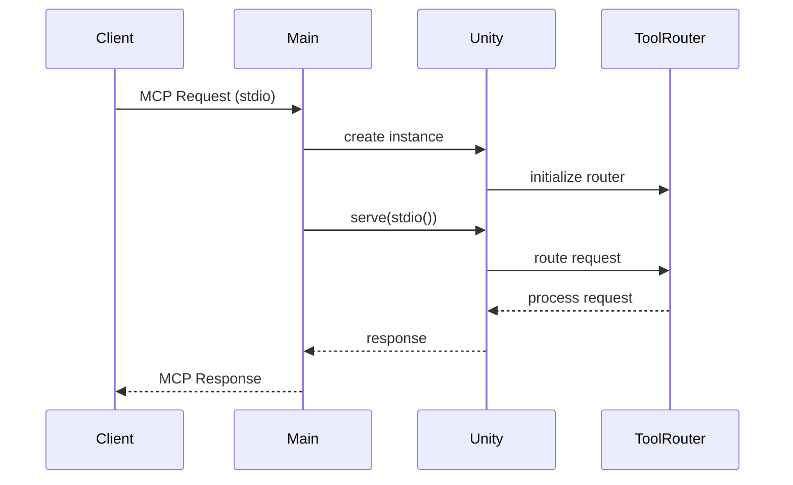
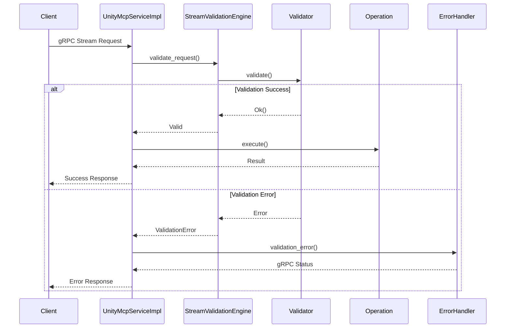

# Server アーキテクチャドキュメント

## 概要

Unity MCP Server は、Rust で実装された MCP (Model Context Protocol) サーバーです。Unity Editor との連携を主目的とし、gRPC 通信によるリアルタイムデータ交換機能を提供します。

## 主要モジュール構成

### 1. エントリポイント（main.rs）

```rust
main() -> Result<()>
```

**役割:**
- アプリケーションの起動点
- tracing ログシステムの初期化
- Unity サービスの起動と待機処理

**依存関係:**
- `Unity` 構造体を生成し、stdio トランスポートで MCP サーバーとして起動

### 2. Unity モジュール（unity.rs）

#### Unity 構造体
```rust
pub struct Unity {
    tool_router: ToolRouter<Unity>,
}
```

**役割:**
- MCP サーバーのメインハンドラー
- ツールルーターによる MCP 操作のディスパッチ
- `ServerHandler` トレイトの実装によるサーバー機能提供

**実装:**
- `#[tool_router]` マクロによる自動ツールルーティング
- `#[tool_handler]` マクロによる MCP プロトコル処理
- `new()` メソッドでインスタンス生成

### 3. gRPC モジュール（grpc/）

#### 3.1 サーバー設定（server.rs）

##### GrpcServerConfig 構造体
```rust
pub struct GrpcServerConfig {
    pub host: String,
    pub port: u16,
    pub max_message_size: usize,
}
```

**役割:**
- gRPC サーバーの設定管理
- デフォルト値の提供（localhost:50051, 4MB メッセージサイズ）

##### GrpcServerBuilder 構造体
**役割:**
- gRPC サーバーのビルダーパターン実装
- 設定可能なサーバーインスタンス生成

#### 3.2 サービス実装（service.rs）

##### UnityMcpServiceImpl 構造体
```rust
pub struct UnityMcpServiceImpl {
    validation_engine: StreamValidationEngine,
    cache: StreamCache,
}
```

**役割:**
- Unity MCP サービスの具体的実装
- リクエスト検証とキャッシュ機能を統合
- gRPC プロトコルによる MCP 操作処理

##### ストリーム操作ハンドラー
- `ImportAssetOperation` - アセットインポート処理
- `MoveAssetOperation` - アセット移動処理
- `DeleteAssetOperation` - アセット削除処理
- `RefreshOperation` - リフレッシュ処理

**共通インターフェース:**
- `StreamOperationHandler` トレイトによる統一的処理

#### 3.3 バリデーション（validation.rs）

##### StreamValidationEngine 構造体
```rust
pub struct StreamValidationEngine {
    import_validator: ImportAssetStreamValidator,
    move_validator: MoveAssetStreamValidator,
    delete_validator: DeleteAssetStreamValidator,
    refresh_validator: RefreshStreamValidator,
    security_rules: SecurityValidationRules,
    performance_monitor: ValidationPerformanceMonitor,
}
```

**役割:**
- ストリームリクエストの総合的検証
- 操作別バリデーターの管理
- セキュリティルール適用
- パフォーマンス監視

##### 専用バリデーター
- `ImportAssetStreamValidator` - インポート操作検証
- `MoveAssetStreamValidator` - 移動操作検証
- `DeleteAssetStreamValidator` - 削除操作検証
- `RefreshStreamValidator` - リフレッシュ操作検証

**共通インターフェース:**
- `StreamRequestValidator` トレイトによる統一的検証

#### 3.4 エラーハンドリング（error.rs）

**役割:**
- MCP エラーから gRPC ステータスへの変換
- 一般的なエラー応答の生成
- 検証エラー、Not Found エラー、内部エラーの処理

**主要関数:**
- `mcp_error_to_status()` - MCP エラー変換
- `validation_error()` - 検証エラー生成
- `not_found_error()` - 404 エラー生成
- `internal_server_error()` - 500 エラー生成

## クラス間関係性

### クラス図



### シーケンス図

#### MCP リクエスト処理フロー



#### gRPC ストリーム処理フロー



## 設計パターン

### 1. ビルダーパターン
- `GrpcServerBuilder` による柔軟なサーバー設定

### 2. ストラテジーパターン
- `StreamOperationHandler` による操作別処理
- `StreamRequestValidator` による検証方式切り替え

### 3. ファサードパターン
- `StreamValidationEngine` による複数バリデーターの統合
- `UnityMcpServiceImpl` による MCP サービス機能の統合

### 4. マクロベース自動生成
- `#[tool_router]` と `#[tool_handler]` による定型処理の自動化

## 拡張ポイント

1. **新しい MCP 操作の追加**
   - `StreamOperationHandler` 実装
   - 対応するバリデーター追加

2. **新しい検証ルール**
   - `StreamRequestValidator` 実装
   - `StreamValidationEngine` への統合

3. **新しいトランスポート**
   - Unity 構造体での新しいトランスポート対応
   - main.rs での起動設定変更