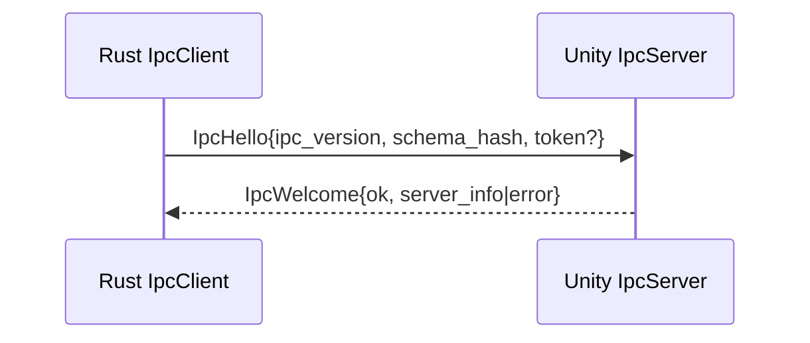
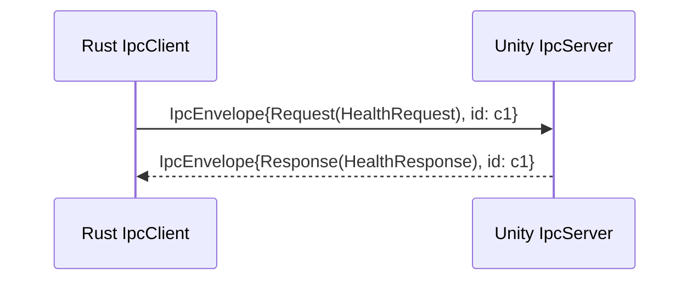

# Direct IPC Migration Plan (Rust MCP Server ↔ Unity Editor)

**Objective:** Replace the current gRPC-based bridge with a *direct IPC* channel between the Rust MCP server and the Unity Editor, while preserving Protocol Buffers as the single source of truth (SSoT) for message schemas. Ship an MVP where `Health` works over IPC end-to-end, then extend to `Logs` and `Operations`.

---

## 1) Goals & Scope
- **Goals**
  - Remove gRPC and its runtime dependencies from both Rust and Unity sides.
  - Keep **Protobuf messages** as the contract; stop generating gRPC service stubs.
  - Implement **local IPC transport**:
    - Unix/macOS: **Unix Domain Socket (UDS)**
    - Windows: **Named Pipe**
    - Optional dev fallback: loopback TCP (127.0.0.1) for debugging.
  - Define a simple, robust **frame format** (length-prefixed) and an **envelope message** for multiplexing requests/responses/events.
  - Deliver an MVP with `Health` round-trip, then `Logs` events, then `Operations` stream.
- **Non-Goals (this phase)**
  - Cross-machine networking, TLS/mtls, multi-user multiplexing beyond a single local user session.
  - Breaking the existing Protobuf message shapes (service definitions may be removed).

---

## 2) Target Architecture (High-Level)
- **Rust MCP Server** hosts the MCP tools and connects to Unity Editor over IPC as a client.
- **Unity Editor** hosts an IPC server that executes editor actions on the main thread (via a dispatcher) and streams log/operation events back to Rust.
- **Envelope protocol** (oneof): `Request`, `Response`, `Event` → carries typed Protobuf payloads.

```mermaid
flowchart LR
  subgraph Rust[MCP Server (Rust)]
    T[Tool Router] --> I[IpcClient]
  end
  subgraph Unity[Unity Editor]
    S[Editor IpcServer] --> D[Main Thread Dispatcher]
  end

  I <--> |UDS / Named Pipe| S
  S -->|Event stream: Logs/Operations| I
```

---

## 3) Transport & Framing
- **Transport:**
  - **UDS** on Unix/macOS at `${XDG_RUNTIME_DIR}/unity-mcp/ipc.sock` or fallback to `${TMPDIR}`.
  - **Named Pipe** on Windows at `\\.\pipe\unity-mcp\<project-or-user>`.
- **Framing:** Length-prefixed frames.
  - Use `tokio_util::codec::LengthDelimitedCodec` (Rust) or equivalent logic in C#.
  - For each frame, the payload is a serialized Protobuf `IpcEnvelope`.
- **Handshake:** The first exchange after connect.
  - Client → Server: `IpcHello { ipc_version, schema_hash, token? }`
  - Server → Client: `IpcWelcome { ipc_version, ok, server_info, error? }`
- **Security (local):**
  - Bind with **user-only** permissions on UDS/Pipe.
  - Optional shared **auth token** in handshake (env or config; not persisted in logs).

---

## 4) Contract: Protobuf Strategy
- Keep `.proto` messages. **Remove service definitions** (or ignore generation) so we don’t emit gRPC stubs.
- Generate Rust and C# message types only.
- Define an **envelope** for multiplexing:

```proto
message IpcEnvelope {
  string correlation_id = 1;   // request-response correlation
  oneof kind {
    IpcRequest  request  = 10;
    IpcResponse response = 11;
    IpcEvent    event    = 12;
  }
}

message IpcRequest {
  // oneof per API
  oneof payload {
    HealthRequest health = 1;
    // AssetsRequest assets = 2; etc.
  }
}

message IpcResponse {
  string correlation_id = 1; // echo
  int32 status_code = 2;     // 0 = OK; otherwise error code
  string message = 3;        // short reason
  oneof payload {
    HealthResponse health = 10;
    // AssetsResponse assets = 11; etc.
  }
}

message IpcEvent {
  int64 monotonic_ts_ns = 1;
  oneof payload {
    LogEvent log = 10;
    OperationEvent op = 11;
  }
}
```

> `correlation_id` is required for matching async responses to requests. The event stream is independent.

---

## 5) Components to Modify
**Rust (server/)**
- Remove `tonic`, `tonic-build`, `tonic-prost` dependencies.
- Add `prost`, `prost-build`, `tokio`, `tokio-util`, `bytes` (and optionally `interprocess`).
- Replace `ChannelManager` with `IpcClient` (connect, handshake, request/response, event subscription).
- Update tools (e.g., `health.rs`) to call `IpcClient` instead of gRPC clients.
- Integration tests: spawn in-process **dummy IPC server** for tests.

**Unity (bridge/Editor/)**
- Add `EditorIpcServer` (Named Pipe/UDS listener), per-connection worker tasks.
- Implement handshake, request dispatch to main thread, response writeback.
- Event publisher for logs & operation updates (throttling for info-level flood).

---

## 6) Step-by-Step Execution Plan

### Step 0 — Prepare Protobuf generation (messages only)
- **build.rs**: switch to `prost-build` and **disable service generation**.
- Output to `server/src/generated/`.
- **Cargo.toml**: remove gRPC deps; add `prost-build`, `tokio`, `tokio-util`, `bytes`.
- **lib.rs**: include generated message module via `include!("generated/…")`.

**Deliverable:** `cargo build` succeeds; no gRPC in dependency tree.

---

### Step 1 — Introduce IPC layer in Rust
- New module `server/src/ipc/`:
  - `framing.rs`: length-delimited codec wrapper and helpers.
  - `client.rs`: connects to UDS/Named Pipe; handshake; request/response API; background event task.
  - `path.rs`: endpoint resolution per OS; default path; env override `MCP_IPC_ENDPOINT`.
  - `codec.rs`: Protobuf encode/decode for `IpcEnvelope`.
- Replace `ChannelManager` usage in `McpService` with `IpcClient` handle.

**Deliverable:** unit tests for frame encode/decode; handshake success path.

---

### Step 2 — Health over IPC (MVP)
- Implement `ipc.health(request) -> HealthResponse` in Rust (send `IpcRequest.health`).
- Unity: implement `EditorIpcServer` minimal handler for Health.
- End-to-end test: MCP tool `health` returns `{"ready": true, "version": "…"}` over IPC.

**Deliverable:** manual test and automated integration test passing on Windows/macOS/Linux.

---

### Step 3 — Logs event stream
- Unity: push `IpcEvent.log` for editor logs (info throttling; warn/error unthrottled).
- Rust: subscribe to events; relay to MCP clients as needed (or log to server console).

**Deliverable:** flood-safe stream verified; backpressure does not stall requests.

---

### Step 4 — Operations stream
- Define `OperationEvent` messages (start/progress/completion with IDs).
- Unity: upon long-running actions, emit op events by ID.
- Rust: surface progress through MCP responses or event relay.

**Deliverable:** sample long operation shows progress updates.

---

### Step 5 — Expand tool coverage
- Convert remaining tools (Assets, Build, etc.) to IPC.
- Each request/response uses the envelope, errors return `status_code != 0` with a short message.

**Deliverable:** parity with previous gRPC-based feature set.

---

### Step 6 — Remove gRPC code and clean up
- Delete `server/src/grpc/*` and tests relying on gRPC stubs.
- Remove CI steps related to gRPC.
- Keep Protobuf compilation only.

**Deliverable:** repo free of gRPC deps; CI green.

---

## 7) Error Handling & Resilience
- **Reconnection:** exponential backoff (cap e.g. 5s), jitter.
- **Timeouts:** connect timeout (e.g. 2s), call timeout per request (configurable).
- **Cancellation:** if caller drops, cancel in-flight request.
- **Poisoned connection:** on decode/encode errors, close and reconnect.
- **Backpressure:** separate tasks for request/response vs. event stream; queue limits with drop policy for low-importance info logs.

---

## 8) Configuration & Defaults
- `MCP_IPC_ENDPOINT`: explicit endpoint (e.g., `unix:///…/ipc.sock` or `pipe://unity-mcp/...`).
- Defaults per OS if env is absent.
- `MCP_IPC_TOKEN`: optional shared secret for handshake.
- Timeouts: `MCP_IPC_CONNECT_TIMEOUT_MS`, `MCP_IPC_CALL_TIMEOUT_MS`.

---

## 9) Security Notes
- UDS: create socket with `0700` dir perms; unlink on exit.
- Named Pipe: restrict to current user (DACL); disallow remote clients.
- Never log tokens; rotate by restarting both ends.

---

## 10) Testing Strategy
- **Unit tests:** framing codec, envelope encode/decode, handshake validation.
- **Integration (Rust-only):** spawn a dummy IPC server implementing Health.
- **E2E (Rust↔Unity):** Health/Logs/Operations on all OSes.
- **Concurrency:** run tests in parallel; avoid port/path collisions via unique per-test endpoints; use temp dirs and random suffixes.
- **Chaos:** kill Unity during long request; verify retries and error surfaces.

---

## 11) CI/CD Changes
- Remove `protoc-grpc` steps; keep `prost-build`.
- Matrix for Windows/macOS/Linux; run E2E with the dummy IPC server (Unity optional); if Unity runner is unavailable, keep Rust-only integration tests mandatory.
- Cache cargo build artifacts.

---

## 12) Rollout & Fallback
- **Recommended:** hard-switch to IPC (no dual transport) to minimize complexity, provided MVP passes.
- Optional feature flag `transport-grpc` for temporary parallelism in early PRs; remove once IPC MVP is stable.

---

## 13) Definition of Done
- **MVP:** Health over IPC, reconnection, timeouts, user-restricted endpoints, CI green.
- **Full:** Logs & Operations streaming; remaining tools parity; gRPC code deleted.

---

## 14) Risks & Mitigations
- **Log floods:** throttling and priority lanes.
- **Deadlocks on Unity main thread:** strict dispatcher pattern; watchdogs for long tasks.
- **Endpoint conflicts:** unique temp paths; cleanup on crash (best-effort unlink).
- **Version skew (schema):** `schema_hash` check and explicit error on mismatch in handshake.

---

## 15) Code Sketches (Rust)

**build.rs**
```rust
fn main() {
  let proto_root = "../proto";
  let files = &[
    "mcp/unity/v1/common.proto",
    "mcp/unity/v1/editor_control.proto",
    // ... others
  ];
  prost_build::Config::new()
    .out_dir("src/generated")
    .compile_protos(files, &[proto_root])
    .unwrap();
}
```

**IpcClient request**
```rust
pub async fn request<TReq: Message, TResp: Message>(
  &self,
  req: TReq,
  pack: fn(TReq) -> IpcRequest,
  unpack: fn(IpcResponse) -> Option<TResp>,
  timeout: Duration,
) -> Result<TResp> { /* send envelope, await response by correlation_id */ }
```

---

## 16) Sequence Examples

**Handshake**


**Health Request**


---

## 17) Implementation Checklist
- [ ] Switch Protobuf generation to message-only.
- [ ] Introduce IPC modules (path, framing, codec, client).
- [ ] Implement handshake and config.
- [ ] Replace ChannelManager usages with IpcClient.
- [ ] MVP: Health E2E.
- [ ] Logs event stream.
- [ ] Operations event stream.
- [ ] Convert remaining tools.
- [ ] Remove gRPC code & CI steps.
- [ ] Add docs and troubleshooting guide.

---

**Next Action:** Execute Step 0 (build.rs/Cargo.toml/lib.rs changes) and scaffold `src/ipc/*`. Commit as a focused PR, then wire `Health` over IPC for the MVP.

