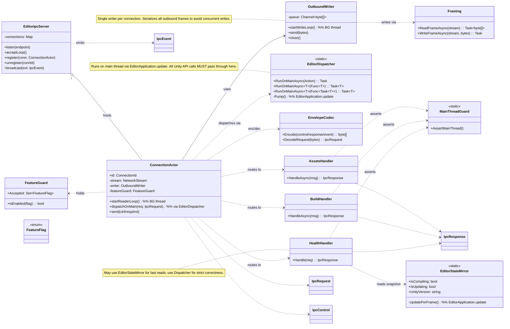

# Editor Bridge — Post‑Refactor Class Diagram

This page shows the target class structure **after** introducing `EditorDispatcher` and splitting IO/Main responsibilities. The diagram emphasizes: (1) one connection = one `ConnectionActor`, (2) all Unity API calls are marshaled onto the main thread via `EditorDispatcher`, and (3) all outbound traffic goes through a single per‑connection `OutboundWriter`.

## Legend
- **BG thread**: background IO / writer loops (non‑Unity API).
- **Main thread**: anything touching Unity Editor or `UnityEngine.Application` — invoked only via `EditorDispatcher`.

## Design Guarantees
- IO and Unity API are separated by an explicit boundary (`ConnectionActor.dispatchOnMain` → `EditorDispatcher`).
- Outbound writes are serialized (`OutboundWriter`), eliminating races on the stream.
- Health checks can be fast (mirror) or strict (dispatcher), chosen per call site.

