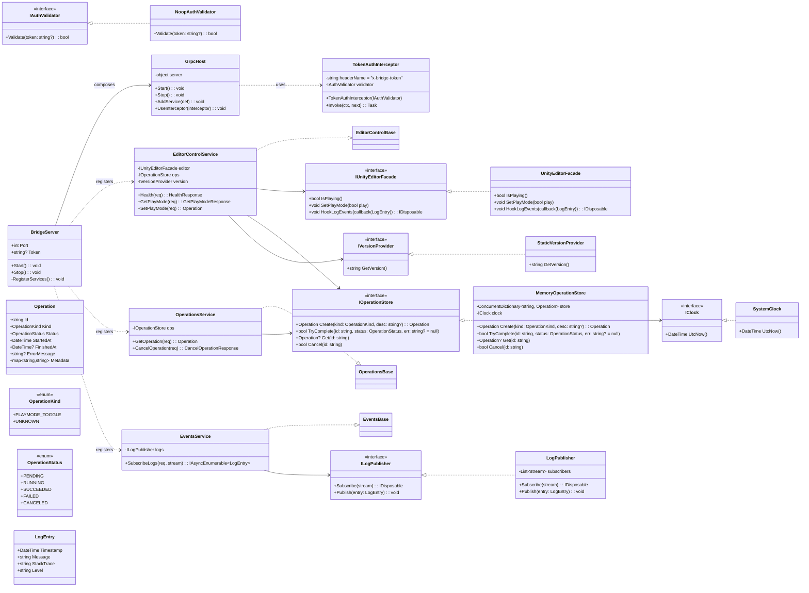
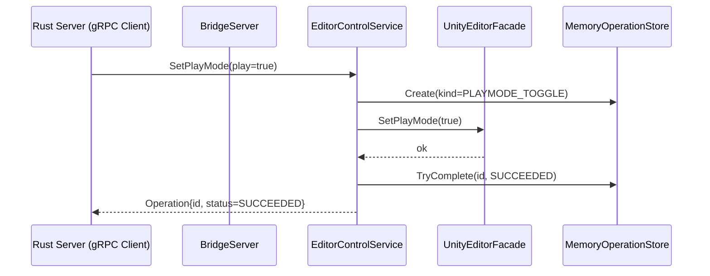
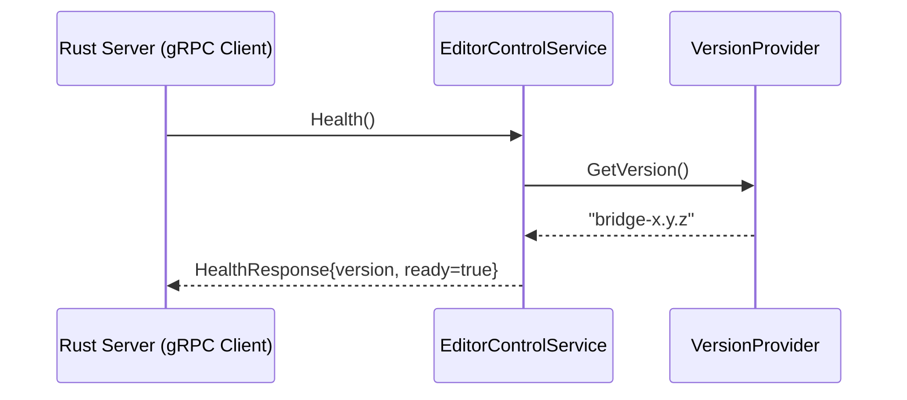

# Phase 2 — Unity Bridge Execution Guide

> Goal: Run a **gRPC server inside the Unity Editor**, implement **EditorControl (Health / GetPlayMode / SetPlayMode)** and a **minimal Operation model**, and verify end‑to‑end with the Rust client.

---

## 0) Scope & Success Criteria (DoD)

**In scope**

- Unity Editor hosts a local gRPC server (Bridge).
- Implement `EditorControl` endpoints:
  - `Health` → returns `{version, ready}`
  - `GetPlayMode` → returns current play state
  - `SetPlayMode` → toggles play/stop and returns an `Operation`
- Minimal **Operation** model (in‑memory) with `SUCCEEDED` on sync completion.
- Rust client (existing ChannelManager + EditorControl client) can call `Health` and `SetPlayMode` successfully.

**Done when**

- Editor starts a gRPC server on a fixed localhost port.
- The three EditorControl RPCs respond correctly.
- An Operation is created and completed for `SetPlayMode`.
- A smoke test (manual or scripted) confirms Rust↔Unity round‑trip.

---

## 1) Repository Layout (Bridge side)

```
bridge/
  Assets/
    Editor/
      Bridge/                       # All bridge sources (Editor-only)
        BridgeServer.cs
        Hosting/GrpcHost.cs
        Hosting/TokenAuthInterceptor.cs
        Services/EditorControlService.cs
        Services/OperationsService.cs        # (stub for now)
        Events/EventsService.cs              # (optional prep only)
        Operations/Operation.cs
        Operations/OperationStore.cs
        Abstractions/IUnityEditorFacade.cs
        Abstractions/UnityEditorFacade.cs
        Abstractions/IVersionProvider.cs
        Abstractions/SystemClock.cs
      Generated/Proto/               # C# from .proto (do not edit)
      Bridge.asmdef                  # Editor-only assembly definition
  Packages/
  ProjectSettings/
```

> **Note:** Keep all runtime types in an **Editor‑only** assembly.

---

## 2) Prerequisites

- Unity 6 or later (6000.x; the Editor can host a C# gRPC Core server).
- C# gRPC dependencies available to the Editor assembly (see §3.2).
- Protobuf and gRPC C# code generated from `proto/mcp/unity/v1/*.proto`.

---

## 3) Protobuf → C# Codegen

We vendor generated C# into the Unity project (keeps Unity build clean, no MSBuild in Editor).

### 3.1 One‑shot local generation (outside Unity)

Use `protoc` and the `grpc_csharp_plugin`:

```bash
# From repo root
PROTO_ROOT=proto
OUT=bridge/Assets/Editor/Generated/Proto
mkdir -p "$OUT"

protoc \
  -I"$PROTO_ROOT" \
  --csharp_out="$OUT" \
  --grpc_out="$OUT" \
  --plugin=protoc-gen-grpc=/path/to/grpc_csharp_plugin \
  $(find "$PROTO_ROOT/mcp/unity/v1" -name '*.proto')
```

> Re-run when `.proto` changes. Commit the generated sources.

### 3.2 Unity dependencies

- **Option A (recommended for Editor)**: `Grpc.Core` (C-core) server in Editor. Add compiled DLLs (and native plugin libgrpc) via UPM/NuGet extraction.
- **Option B**: `Grpc.AspNetCore` w/ Kestrel (requires .NET runtime support in Editor; heavier). Use only if you already host ASP.NET in Editor.

For Phase 2, **Option A** is simpler: Editor process hosts a gRPC Core server.

---

## 4) Configuration & Security

- **Endpoint:** `127.0.0.1:50061` (configurable in `BridgeServer` → Editor Preferences/ScriptableObject).
- **Auth:** Accept an optional **bridge token** via metadata header `x-bridge-token`. For Phase 2, make it optional or use a no‑op validator.
- **Logging:** Use Unity console and (optionally) a ring buffer. Events streaming can be wired later.

> Avoid environment variables for Editor configuration. Prefer a `ScriptableObject` stored under `ProjectSettings/` or `Assets/Editor/Bridge/Settings.asset`.

---

## 5) Implementation Steps

### Step 1 — Assembly & Settings

1. Create `Bridge.asmdef` marked **Editor only**.
2. Add references to `Grpc.Core` DLLs (and native plugin for your OS).
3. Create `BridgeSettings` ScriptableObject:
   - `int Port = 50061`
   - `string Token = ""` (optional)

### Step 2 — Hosting layer

- ``: wraps the gRPC server lifecycle.
  - `Start()` binds to `127.0.0.1:Port`.
  - `AddService(ServerServiceDefinition)` for each service.
  - `UseInterceptor(TokenAuthInterceptor)` if token is configured.
- ``:
  - Orchestrates `GrpcHost`. Registered via `[InitializeOnLoad]` or menu: *Bridge ▸ Start/Stop*.
  - Registers services: `EditorControlService`, `OperationsService` (stub), `EventsService` (optional).

### Step 3 — Auth Interceptor

- ``:
  - Reads metadata `x-bridge-token`.
  - Validates via `IAuthValidator` (Phase 2: `NoopAuthValidator`).

### Step 4 — Abstractions

- ``** / **``:
  - `bool IsPlaying()` → `EditorApplication.isPlaying`
  - `void SetPlayMode(bool play)` → toggle `EditorApplication.isPlaying` safely on main thread
  - `IDisposable HookLogEvents(...)` → wire `Application.logMessageReceivedThreaded`
- ``: return bridge version string.
- ``** / **``: testable time source.

### Step 5 — Operation model

- ``
  - `Id`, `Kind`, `Status`, `StartedAt`, `FinishedAt?`, `ErrorMessage?`, `Metadata`
  - `Status`: `PENDING|RUNNING|SUCCEEDED|FAILED|CANCELED`
- ``** / **`` (thread‑safe dictionary)
  - `Create(kind, desc?)`
  - `TryComplete(id, status, err?)`
  - `Get(id)`, `Cancel(id)` (Phase 2: `Cancel` may return `false`)

### Step 6 — Services (gRPC)

- `` (inherits generated base)
  - `Health` → `{ version = IVersionProvider.GetVersion(), ready = true }`
  - `GetPlayMode` → `{ is_playing = IUnityEditorFacade.IsPlaying() }`
  - `SetPlayMode` →
    1. `op = ops.Create(PLAYMODE_TOGGLE, ...)`
    2. `editor.SetPlayMode(req.play)` (ensure main‑thread dispatch)
    3. `ops.TryComplete(op.Id, SUCCEEDED)`
    4. return `op`
- `` (Phase 2 minimal)
  - `GetOperation` → lookup and return from store
  - `CancelOperation` → return `accepted = false` (placeholder)
- `` (optional skeleton)
  - `SubscribeLogs` → keep for Phase 3; here only the publisher interface exists

### Step 7 — Wiring & Startup

- On Editor load or via menu **Start Bridge**:
  - Build `ServerServiceDefinition` for each service and add to `GrpcHost`.
  - Start server; log *Listening on 127.0.0.1:50061*.
- **Stop Bridge** disposes services and host.

---

## 6) Test Procedure (Manual E2E)

1. **Start Unity** with the Bridge project; confirm *Bridge started* in Console.
2. **Run Rust client** (ChannelManager) pointing to `127.0.0.1:50061`.
3. Call `EditorControl.Health` → expect `{ ready: true }`.
4. Call `EditorControl.GetPlayMode` → observe current state.
5. Call `EditorControl.SetPlayMode(play=true)` → Unity enters Play mode; Operation returns `SUCCEEDED`.
6. Call `EditorControl.SetPlayMode(play=false)` → exits Play; Operation returns `SUCCEEDED`.

> If a token is configured in Unity, supply `x-bridge-token: <value>` from the client.

---

## 7) Risks & Mitigations

- **Main thread access**: Use `EditorApplication.delayCall` or a dispatcher to change play mode.
- **Port conflicts**: Make port configurable; detect in use and fail fast.
- **gRPC native libs**: Ensure correct libgrpc native binaries are present per OS for Editor process.
- **Stability**: Guard server start/stop with idempotence.

---

## 8) Next Steps (Phase 3 seeds)

- Implement `CancelOperation` and long‑running Operations.
- Add `EventsService.SubscribeLogs` streaming with back‑pressure.
- Harden auth (mandatory token, rotation, allowlist of clients).

---

## Appendix A — Class Diagram



---

## Appendix B — Sequence Diagrams

### B.1 SetPlayMode (Play = true)



### B.2 Health



---

## Checklists

### Developer Checklist

-

### E2E Checklist

-

