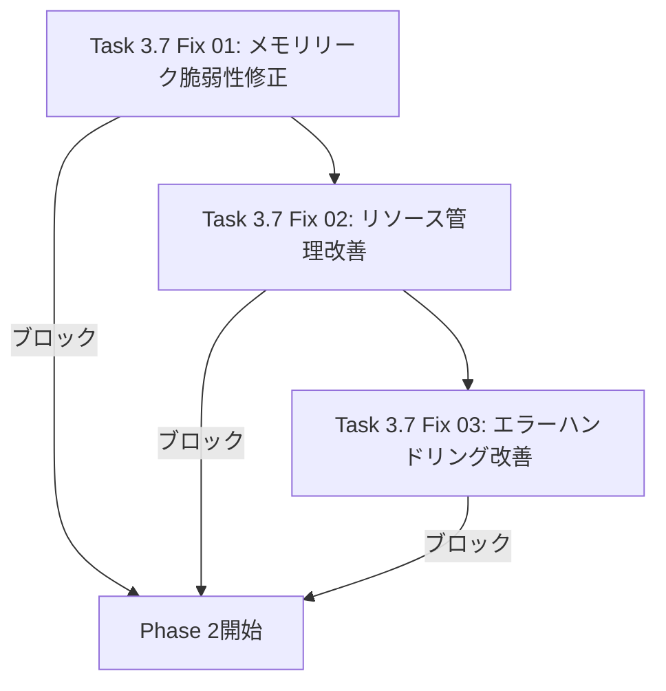
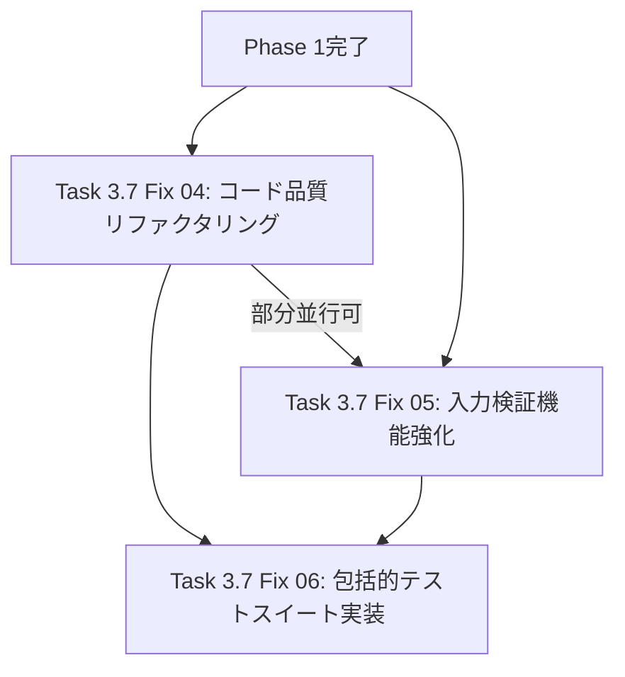
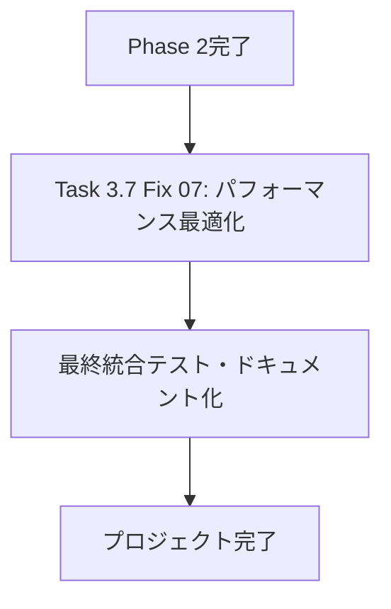

# Task 3.7 修正プロジェクト実行計画とスケジュール

## エグゼクティブサマリー

Unity MCP Server Task 3.7のストリーミングサービス実装に対する包括的修正プロジェクトの実行計画です。コードレビューで特定された重大な問題を段階的に解決し、高品質で安全なストリーミングサービスを実現します。

### 修正スコープ
- **重大なセキュリティ脆弱性**の修正
- **リソース管理とメモリリーク**の解決  
- **コード品質と保守性**の向上
- **包括的テストスイート**の実装
- **パフォーマンス最適化**の実施

## プロジェクト構造と依存関係

### Phase 1: 緊急セキュリティ修正 (最高優先度 🔴)



**期間**: 1週間 (5営業日)  
**担当者**: 1名のシニア開発者  
**並行作業**: 不可（依存関係により順次実行必須）

### Phase 2: コード品質改善 (重要優先度 🟡)



**期間**: 1.5週間 (7営業日)  
**担当者**: 1-2名の開発者  
**並行作業**: Fix 04と05は部分的に並行実行可能

### Phase 3: パフォーマンス最適化 (中優先度 🟡)



**期間**: 1週間 (5営業日)  
**担当者**: 1名のシニア開発者  
**並行作業**: 不可（全修正の統合が前提）

## 詳細実行スケジュール

### Week 1: Phase 1 - 緊急セキュリティ修正

| 日 | タスク | 実装時間 | 検証時間 | マイルストーン |
|---|-------|---------|---------|------------|
| Mon | Fix 01: メモリリーク脆弱性修正 | 6h | 2h | unbounded→boundedチャネル完了 |
| Tue | Fix 02: リソース管理改善 (前半) | 6h | 2h | サービスインスタンス共有実装 |
| Wed | Fix 02: リソース管理改善 (後半) | 4h | 2h | タスクライフサイクル管理完了 |
| Wed | Fix 03: エラーハンドリング改善 (前半) | 2h | - | エラータイプシステム構築 |
| Thu | Fix 03: エラーハンドリング改善 (後半) | 4h | 2h | 統一エラーレスポンス完了 |
| Fri | Phase 1統合テスト・レビュー | 2h | 4h | **Phase 1完了** |

**Phase 1成功基準**:
- [ ] メモリリーク脆弱性完全排除
- [ ] DoS攻撃耐性確認
- [ ] 基本機能100%動作確認
- [ ] セキュリティスキャンクリア

### Week 2: Phase 2 - コード品質改善 (前半)

| 日 | タスク | 実装時間 | 検証時間 | マイルストーン |
|---|-------|---------|---------|------------|
| Mon | Fix 04: コード品質リファクタリング (設計) | 2h | - | 新アーキテクチャ設計完了 |
| Mon | Fix 05: 入力検証機能強化 (設計) | 2h | - | 検証フレームワーク設計完了 |
| Tue | Fix 04: 基盤クラス実装 | 6h | 2h | StreamConnectionHandler完了 |
| Wed | Fix 04: 個別ハンドラー実装 | 6h | 2h | 全ハンドラーリファクタリング完了 |
| Wed | Fix 05: 検証エンジン実装 (開始) | 2h | - | 基本検証フレームワーク開始 |
| Thu | Fix 05: 検証エンジン実装 (完了) | 6h | 2h | セキュリティ検証機能完了 |
| Fri | Phase 2前半統合テスト | 2h | 4h | コード品質改善完了 |

### Week 3: Phase 2 - コード品質改善 (後半) + Phase 3開始

| 日 | タスク | 実装時間 | 検証時間 | マイルストーン |
|---|-------|---------|---------|------------|
| Mon | Fix 06: テストスイート実装 (単体) | 6h | 2h | 単体テスト完了 |
| Tue | Fix 06: テストスイート実装 (統合) | 6h | 2h | 統合テスト完了 |
| Wed | Fix 06: パフォーマンス・セキュリティテスト | 4h | 2h | 全テストスイート完了 |
| Wed | **Phase 2完了確認** | - | 2h | **Phase 2完了** |
| Thu | Fix 07: パフォーマンス最適化 (設計・基盤) | 6h | 2h | 最適化アーキテクチャ完了 |
| Fri | Fix 07: 並列処理・キャッシュ実装 | 6h | 2h | パフォーマンス機能実装完了 |

**Phase 2成功基準**:
- [ ] コードカバレッジ90%以上
- [ ] 循環的複雑度10以下
- [ ] セキュリティテスト100%パス
- [ ] 回帰テスト全通

### Week 4: Phase 3完了・最終統合

| 日 | タスク | 実装時間 | 検証時間 | マイルストーン |
|---|-------|---------|---------|------------|
| Mon | Fix 07: 統合・ベンチマーク | 4h | 4h | パフォーマンス目標達成 |
| Tue | 最終統合テスト | 2h | 6h | 全機能統合確認 |
| Wed | ドキュメント化・レビュー準備 | 4h | 2h | 成果物完成 |
| Thu | 最終レビュー・修正 | 4h | 4h | レビュー完了 |
| Fri | リリース準備・成果報告 | 2h | 2h | **プロジェクト完了** |

**Phase 3成功基準**:
- [ ] スループット2000 req/s以上
- [ ] P95レイテンシー25ms以下
- [ ] メモリ使用量30%削減
- [ ] 100同時接続対応

## リスク管理と緩和策

### 高リスク要因

#### 1. 大規模リファクタリングによる機能回帰
**影響度**: 高 | **発生確率**: 中
**緩和策**:
- 各フェーズでの包括的回帰テスト実施
- 既存テストスイートの継続実行
- 段階的ロールバック計画の準備

#### 2. パフォーマンス最適化による予期しない副作用
**影響度**: 中 | **発生確率**: 中
**緩和策**:
- 詳細なベンチマーク測定
- A/Bテスト環境での検証
- 段階的な最適化適用

#### 3. スケジュール遅延リスク
**影響度**: 高 | **発生確率**: 中
**緩和策**:
- 各タスクに20%のバッファ時間確保
- 週次進捗レビューによる早期検出
- 優先度に基づく機能調整

### 中リスク要因

#### 4. 複雑な依存関係による開発効率低下
**影響度**: 中 | **発生確率**: 中
**緩和策**:
- 明確な依存関係ドキュメント化
- インターフェース定義の事前確定
- モックを活用した並行開発

#### 5. テスト環境の不整合
**影響度**: 中 | **発生確率**: 低
**緩和策**:
- Docker化による環境統一
- CI/CDパイプラインでの自動テスト
- 本番環境相当のテスト環境準備

## 成功メトリクスと監視

### フェーズ別KPI

#### Phase 1: セキュリティ
- [ ] 脆弱性スキャン結果: 0件
- [ ] DoS攻撃シミュレーション: 耐性確認
- [ ] メモリリーク検出: 0件

#### Phase 2: 品質
- [ ] コードカバレッジ: >90%
- [ ] 循環的複雑度: <10
- [ ] 重複コード削減: >80%

#### Phase 3: パフォーマンス
- [ ] スループット: >2000 req/s
- [ ] レイテンシーP95: <25ms
- [ ] メモリ使用量削減: >30%

### 継続監視項目
- 日次ビルド成功率
- テスト実行時間
- コードレビュー完了時間
- 欠陥発見・修正時間

## リソース計画

### 人的リソース
- **シニア開発者 1名**: Phase 1、3のリード
- **中級開発者 1名**: Phase 2のサポート、テスト実装
- **レビューア 1名**: 週次レビュー、最終承認

### インフラリソース
- **開発環境**: Docker化された統一環境
- **テスト環境**: 本番相当のスペック確保
- **CI/CD環境**: 自動テスト・デプロイ機能
- **監視ツール**: パフォーマンス・セキュリティ監視

### 外部依存
- **セキュリティ監査**: 第3者による脆弱性確認
- **パフォーマンステスト**: 負荷テストツール確保
- **レビューツール**: 静的解析・品質監視ツール

## 変更管理プロセス

### コードレビュープロセス
1. **自己レビュー**: 実装者による事前確認
2. **ピアレビュー**: 同僚開発者によるコードレビュー  
3. **テクニカルレビュー**: シニア開発者による技術確認
4. **最終承認**: プロジェクトリーダーによる承認

### ブランチ戦略
```
main
├── feature/fix-01-memory-leak
├── feature/fix-02-resource-management
├── feature/fix-03-error-handling
├── feature/fix-04-code-quality
├── feature/fix-05-input-validation
├── feature/fix-06-test-suite
└── feature/fix-07-performance
```

### マージ条件
- [ ] すべてのテストが通過
- [ ] コードレビュー承認完了
- [ ] セキュリティチェック合格
- [ ] パフォーマンス基準達成

## 品質保証計画

### テスト戦略
1. **単体テスト**: 各機能の個別検証
2. **統合テスト**: コンポーネント間連携確認
3. **システムテスト**: 全体動作確認
4. **パフォーマンステスト**: 性能基準確認
5. **セキュリティテスト**: 脆弱性検証
6. **回帰テスト**: 既存機能影響確認

### 品質ゲート
各フェーズでの品質基準クリア確認:
- **コード品質**: 静的解析結果
- **テスト品質**: カバレッジ・成功率
- **セキュリティ**: 脆弱性スキャン結果
- **パフォーマンス**: ベンチマーク結果

## コミュニケーション計画

### ステークホルダー
- **開発チーム**: 日次スタンドアップ
- **プロジェクトマネージャー**: 週次進捗報告
- **品質保証チーム**: フェーズ完了時レビュー
- **セキュリティチーム**: Phase 1完了時監査

### レポート体制
- **日次**: 進捗・ブロッカー報告
- **週次**: KPI・リスク状況報告  
- **フェーズ完了時**: 成果物・品質評価報告
- **プロジェクト完了時**: 最終成果・学習点報告

## 成功条件と完了基準

### 必須条件 (Must Have)
- [ ] 全セキュリティ脆弱性の修正
- [ ] メモリリーク完全防止
- [ ] 基本機能の完全動作
- [ ] 90%以上のテストカバレッジ

### 重要条件 (Should Have)  
- [ ] パフォーマンス目標達成
- [ ] コード品質指標達成
- [ ] 包括的ドキュメント完成
- [ ] 運用監視機能実装

### 希望条件 (Nice to Have)
- [ ] 追加最適化機能
- [ ] 拡張監視ダッシュボード
- [ ] 自動化ツール強化

## プロジェクト完了判定

### 技術的完了基準
1. ✅ 全修正タスクの実装完了
2. ✅ 品質基準の達成確認
3. ✅ セキュリティ監査合格
4. ✅ パフォーマンステスト合格
5. ✅ 統合テスト全通

### 業務的完了基準
1. ✅ ステークホルダー承認取得
2. ✅ ドキュメント納品完了
3. ✅ 運用手順書作成完了
4. ✅ 引き継ぎ作業完了

---

**プロジェクト期間**: 4週間 (20営業日)  
**予想工数**: 140-160時間  
**リスクバッファ**: 20% (28-32時間)  
**最終予算**: 180時間相当  

このプロジェクト実行計画に従い、Task 3.7の品質問題を体系的に解決し、高品質なストリーミングサービスを実現します。