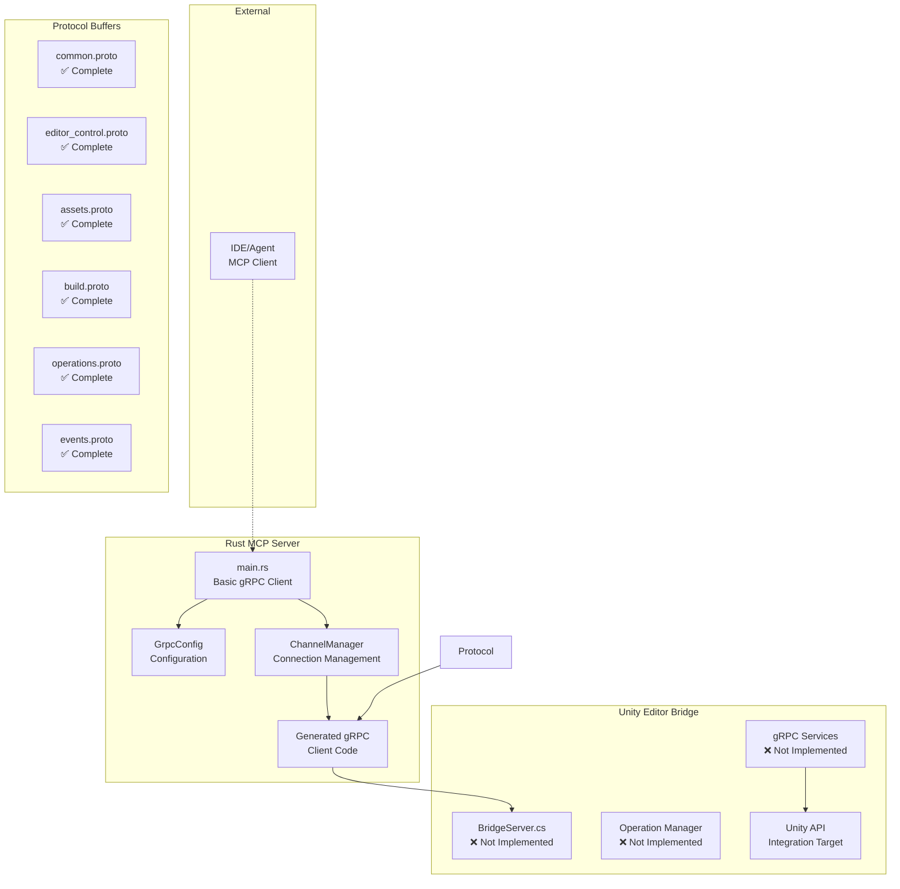
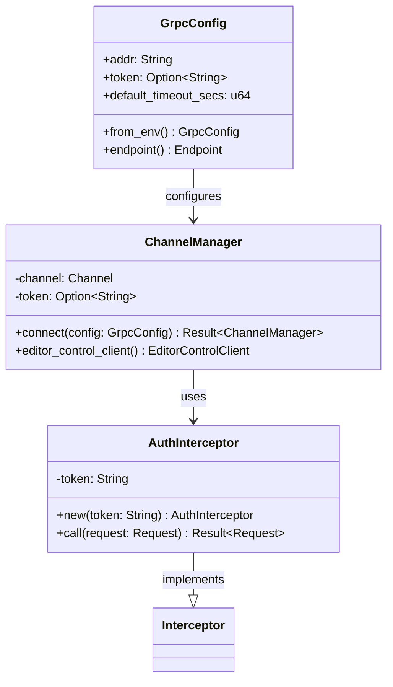
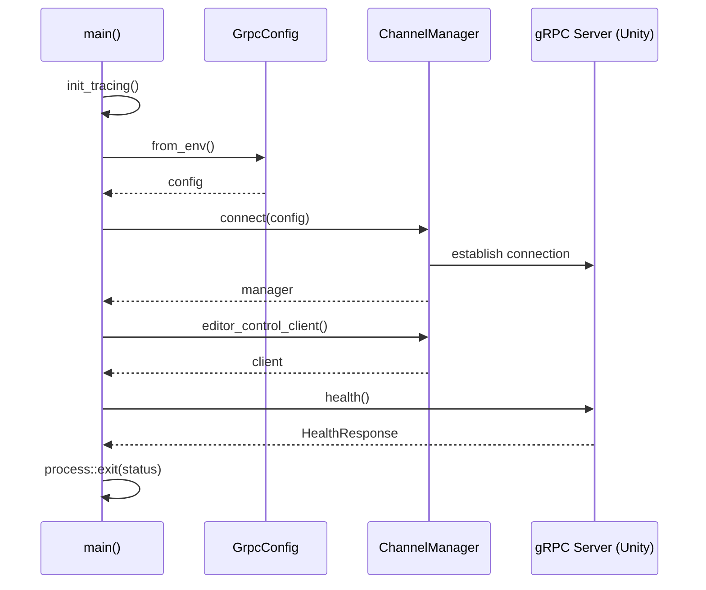
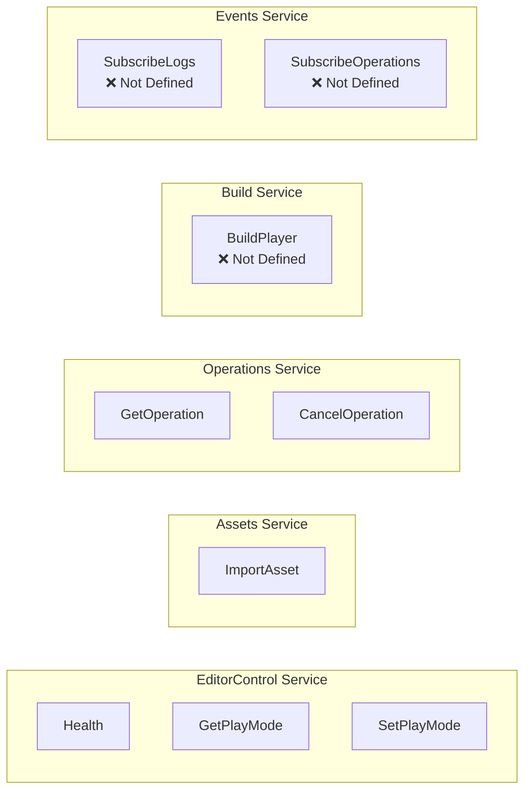

# Unity MCP Server - 現在の実装状態概要

*生成日時: 2025-08-13*

## プロジェクト概要

Unity MCP ServerはRust製のMCPサーバーとUnity Editor Bridgeを組み合わせ、IDEやエージェントからUnityの操作を可能にするシステムです。現在は基礎インフラが実装済みで、MCP本体の実装が次の段階となっています。

## アーキテクチャ図



## 実装済みコンポーネント詳細

### Rust Server基盤

#### クラス図 - gRPCクライアント層



#### 現在の main.rs 実装



### Protocol Buffers 定義

#### gRPCサービス構造



#### メッセージ型構造

```mermaid
classDiagram
    class HealthRequest {
        <<proto>>
        (empty)
    }
    
    class HealthResponse {
        <<proto>>
        +ready: bool
        +version: string
        +status: string
    }
    
    class OperationRef {
        <<proto>>
        +id: string
    }
    
    class ImportAssetRequest {
        <<proto>>
        +path: string
    }
    
    class ImportAssetResponse {
        <<proto>>
        +queued: bool
        +op_id: string
    }
    
    class OperationGetRequest {
        <<proto>>
        +id: string
    }
    
    class OperationGetResponse {
        <<proto>>
        +id: string
        +state: string
        +message: string
    }
```

## 未実装コンポーネント

### 重要度：最高 ❌

1. **MCP Server本体**
   - rmcp SDK統合
   - MCPツール定義
   - JSON-RPC over stdio/SSE

2. **Unity Bridge gRPCサーバー**
   - `BridgeServer.cs`
   - サービス実装
   - Unity APIとの統合

### 重要度：高 ❌

3. **Operation管理システム**
   - 非同期操作の追跡
   - 進捗レポート
   - ストリーミング

4. **完全なProtocol Buffer定義**
   - Build service詳細
   - Events service詳細
   - エラーハンドリング

## ファイル構造現状

```
unity-mcp/
├── server/                     ✅ Rust gRPCクライアント基盤
│   ├── src/
│   │   ├── main.rs            ✅ 基本健康チェッククライアント
│   │   ├── lib.rs             ✅ モジュール定義
│   │   ├── grpc.rs            ✅ gRPCモジュールエクスポート
│   │   └── grpc/
│   │       ├── config.rs      ✅ gRPC設定管理
│   │       └── channel.rs     ✅ 接続・認証管理
│   ├── tests/
│   │   └── smoke.rs           ✅ gRPCラウンドトリップテスト
│   ├── build.rs               ✅ Protocol Bufferコード生成
│   └── Cargo.toml             ✅ 依存関係（rmcp未追加）
├── proto/mcp/unity/v1/         ✅ Protocol Buffer定義完了
│   ├── common.proto           ✅ 基本型定義
│   ├── editor_control.proto   ✅ エディター制御
│   ├── assets.proto           ✅ アセット操作（最小）
│   ├── build.proto            ✅ ビルド操作（空）
│   ├── operations.proto       ✅ 操作管理
│   └── events.proto           ✅ イベント配信（空）
└── bridge/                     ❌ Unity側実装未開始
    ├── Assets/MCP/Editor/      ❌ 空ディレクトリ（.keep）
    ├── Assets/MCP/Runtime/     ❌ 空ディレクトリ（.keep）
    └── Packages/com.example.mcp-bridge/ ❌ UPMパッケージ定義のみ
```

## テスト状況

### 実装済み
- ✅ `smoke.rs` - gRPCラウンドトリップ健康チェック統合テスト
- ✅ 単体テスト（`GrpcConfig`, `ChannelManager`）

### 未実装
- ❌ MCP統合テスト
- ❌ Unity Bridge統合テスト
- ❌ E2Eテスト

## 次のマイルストーン

### 段階1: MCP基盤実装
1. `rmcp` SDK依存関係追加
2. `server/src/mcp/` モジュール作成
3. 基本MCPツール定義（health）

### 段階2: Unity Bridge実装
1. `bridge/Assets/MCP/Editor/BridgeServer.cs`
2. EditorControlサービス実装
3. gRPCサーバー起動ロジック

### 段階3: 統合
1. MCP ↔ Unity E2E接続
2. PlayMode制御実装
3. 完全な健康チェックフロー

---

## 技術スタック

**Rust Server:**
- tokio（非同期ランタイム）
- tonic（gRPCクライアント）
- prost（Protocol Buffers）
- tracing（ログ・トレーシング）
- anyhow（エラーハンドリング）

**Unity Bridge:**
- C#
- Unity Editor API
- Grpc.AspNetCore（予定）
- Google.Protobuf（予定）

**開発環境:**
- Protocol Buffers 3.21.12+
- Cargo features: `server-stubs`（テスト用）

現在のプロジェクトは堅実な基盤が構築済みで、MCP本体の実装により初回の動作デモが可能になる段階です。